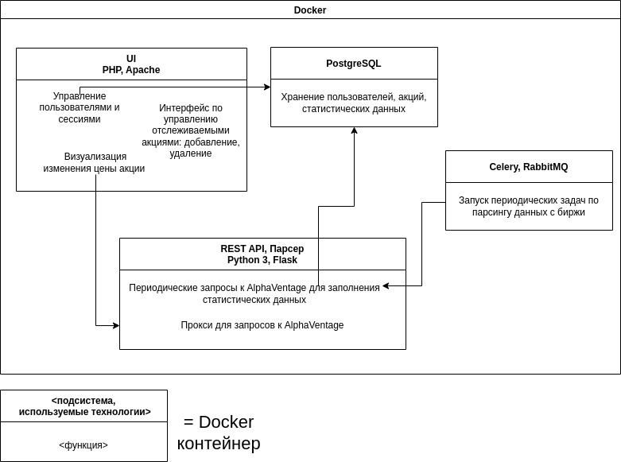
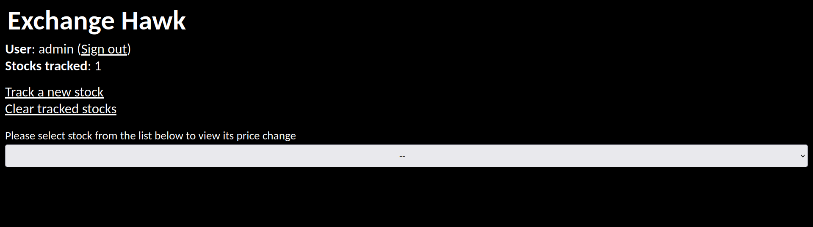
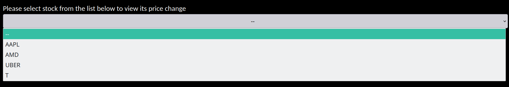
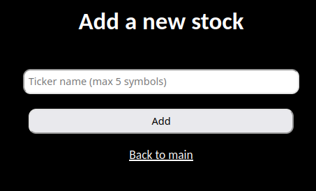
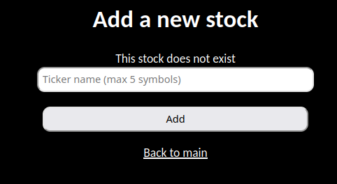
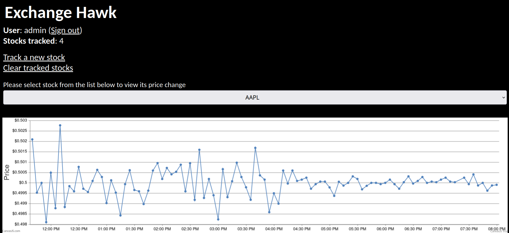

# Exchange Hawk

Сервис для просмотра персонализированного курса акций за текущий день

# Особенности

- Микросервисная архитектура
- Разделение акций на аккаунты (каждый пользователь видит только свои акции)
- Получение данных с биржи в реальном времени
- Визуализация данных на стороне клиента
- Фоновая загрузка данных для анализа

# Технологии

- PHP (клиентское приложение, взаимодействие с БД, визуализация [+ JS]).
- Python (парсер)
- Celery
- RabbitMQ (backend для Celery)
- PostgreSQL
- Docker (+ docker-compose)

# Взаимодействие

# Скриншоты

### Регистрация

### Вход

### Валидация ошибок

Валидируются следующие кейсы:

- Наличие учетной записи
- Заполненность полей
- Если существует учетная запись с одинаковым логином

Пользователь будет перенаправлен на страницу входа если попытается зайти на главную страницу не выполнив вход.

### Главная страница

### Выбор акций

### Добавление акций

### Валидация акций при добавлении

Проверяется, что

- акция существует (такой тикер зарегистрирован)
- пользователь **не отслеживает** эту акцию на данный момент
  

### Визуализация изменения курса акции

